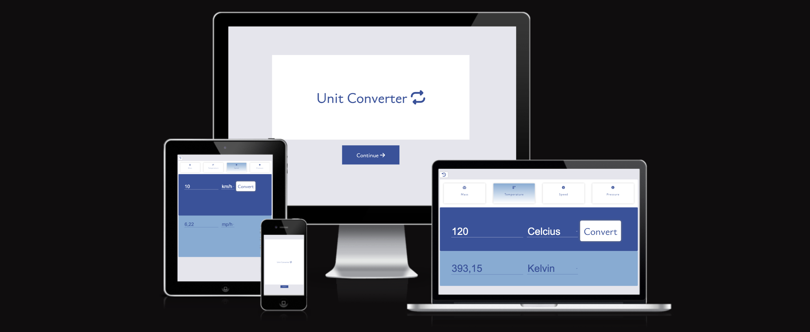
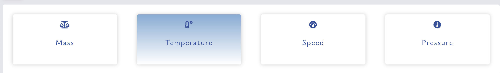
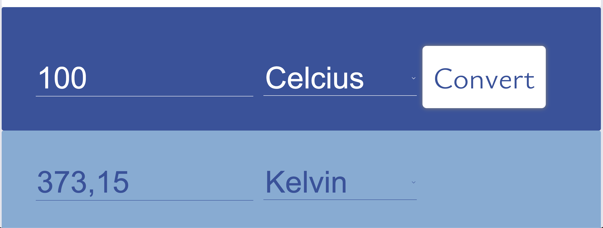

#  Unit Converter 

[LIVE LINK](https://chathugaj.github.io/unit-converter/index.html)

Unit Converter is an application that provides the user the capability of converting quantities of different measurement units to another type of measurement unit of the same type of measurement.
It contains a simple interface that can be used by any user using devices with variying screen sizes.

## Features
### Existing Features
#### Welcome screen
- This is the landing screen for the application. It contains the application name and a button to continue to the next screen, where the actual converter application is.

#### Application screen
- This screen contains the converter application. The application contains various features which are listed below with a short description.

##### Measure type button bar

- In this four buttons bar user can choose which measure type user needs to convert, between mass,temperature,pressure and speed. Selecting a measure type will load the correct measurement units to the application screen

##### Converter area

- Converter area contains two sections, input section and the converted result output section

##### Conversion history
- Conversion history shows the latest five conversions done by a user.

##### Validation messages
- Validation messages are shown to users when user provies invalid inputs.

### Features to add
- Add support for more measure types (ex: Volume) 
- Show the conversion formula

## Testing
### Browser testing
Tested the site with the following browsers.

- Google Chrome
- Mozilla Firefox
- Microsoft Edge

### Test matrix

Following are the test run on the application in order to verify application is working as intended

### Responsiveness

* Tested the responsiveness in the browsers listed above and for different sized devices.
  * Tested the site from width 200px to 2050px using developer tools.
  * Tested the site for different mobile devices with the help of developer tools. Following are the devices tested
    * Pixel 5
    * Pixel 2
    * Surface Duo
    * Apple iPad mini
    * Apple iPad Air
  * Up to width 600px the button bar layout is verticle and after 600px it switches to verticle layout.
  * Maximum width of the website is 2000px

### Problems encountered
* It was an interesting problem to solve the history of the conversions.Finding out how to display the history and how to maitain the history globally. Using W3Schools I found using a modal popup is easy to show the history. Used a global array and pushing the conversion objects to that to keep the conversion history
* Breaking the code into sensible functions was really hard. Using trial and error, figured out to use functions with parameters makes things a bit easier.

### Validator testing
Validated the HTML, CSS and Javascript using W3C Html Validator, Jigsaw Validator and JSHint
* Link to index.html validation [index.html](https://validator.w3.org/nu/?doc=https%3A%2F%2Fchathugaj.github.io%2Funit-converter%2Findex.html)
* Link to CSS validation [style.css](https://jigsaw.w3.org/css-validator/validator?uri=https%3A%2F%2Fchathugaj.github.io%2Funit-converter%2Fassets%2Fcss%2Fstyle.css&profile=css3svg&usermedium=all&warning=1&vextwarning=&lang=en)
* Javascript validation 

### Performance

Tested accessiblity, performance and best practices using the lighthouse plugin in Google Chrome developer tools
 

## Unfixed bugs

Did not find any unintentional bugs in the final testing rounds

## Further improvements
- More measuring units can be supported
- Application starts with a default selected measure type and relevant units loaded in the select elements
- If from and to units are the same show the same output as the input

## Deployment
The site was deployed to GitHub pages.
The steps to deploy are as follows:
In the [Github repository](https://github.com/chathugaj/unit-converter), navigate to the Settings tab
From the source section drop-down menu, select the Master Branch,

Once the master branch has been selected, the page will be automatically refreshed with a detailed ribbon display to indicate the successful deployment.

- live link can be found here 
  [Live link](https://chathugaj.github.io/unit-converter/)

## Credits
### Content
- Modal is taken from W3Schools
  [[How To Create a Modal Box](https://www.w3schools.com/howto/howto_css_modals.asp)]
- The icons on benefits sections and footer were taken from 
  [font awesome](https://fontawesome.com/icons)
- font-family for the website were taken from google font
[google font](https://fonts.google.com/)

### Media 
- Favicon is geenrated using the following website.
  - [favicon](https://favicon.io/favicon-generator/)
- Checked site responsiveness with 
  - [amiresponsive](https://ui.dev/amiresponsive)